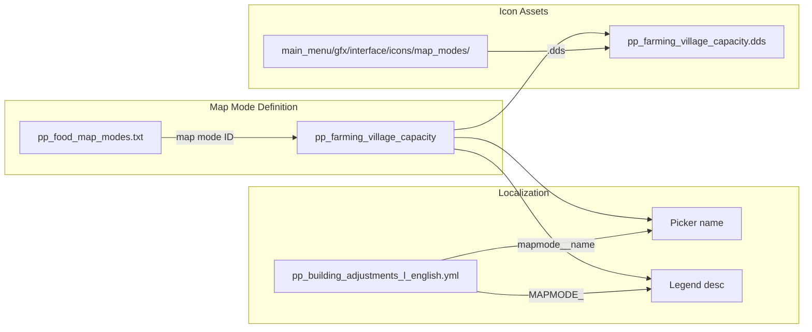

# Map Mode Icons — How They Work

## ⚠️ ICON PATH — READ FIRST

**Map mode icon `.dds` files go ONLY in:**
```
main_menu/gfx/interface/icons/map_modes/<map_mode_id>.dds
```

**NEVER put them in** `in_game/gfx/interface/icons/map_modes/` — that folder is for something else. Icons live in `main_menu` only.

---

This document explains how Prosper or Perish map modes get their icons displayed in the map mode picker and legend. Three components must align: the map mode definition, localization keys, and the icon file.

## Overview

The game resolves map mode icons by **ID-based lookup**. When a map mode is defined with ID `pp_farming_village_capacity`, the game:

1. Uses the **map mode ID** to look up the icon file
2. Uses **localization keys** for the name and legend text
3. Expects the icon file to be named exactly like the map mode ID



---

## Required Components

### 1. Map Mode Definition (`in_game/gfx/map/map_modes/`)

Each map mode block’s key is the **map mode ID**:

```
pp_farming_village_capacity = {
    legend_key = {
        desc = "MAPMODE_PP_FARMING_VILLAGE_CAPACITY"
        ...
    }
    ...
}
```

### 2. Localization (`main_menu/localization/english/`)

| Purpose | Key Pattern | Example |
|---------|-------------|---------|
| Picker (short name in map mode selector) | `mapmode_<id>_name` | `mapmode_pp_farming_village_capacity_name` |
| Legend (full description) | `MAPMODE_<ID>` | `MAPMODE_PP_FARMING_VILLAGE_CAPACITY` |
| Tooltip (land locations) | `MAPMODE_<ID>_TT_LAND` | `MAPMODE_PP_FARMING_VILLAGE_CAPACITY_TT_LAND` |

The legend key `MAPMODE_<ID>` uses the ID in uppercase with underscores.

### 3. Icon File (`main_menu/gfx/interface/icons/map_modes/`)

- **Path:** `main_menu/gfx/interface/icons/map_modes/`
- **Naming:** `<map_mode_id>.dds`
- **Example:** Map mode `pp_farming_village_capacity` → `pp_farming_village_capacity.dds`

**Format requirements (Paradox Clausewitz engine):**

- Format: DDS (DirectDraw Surface)
- Resolution: divisible by 4
- Generate mip maps when exporting (Paint.NET, GIMP, etc.)

---

## Checklist: Adding a New Map Mode with Icon

1. **Define the map mode** in `in_game/gfx/map/map_modes/`:
   - Block key = map mode ID
   - `legend_key.desc` = `MAPMODE_<ID_UPPERCASE>`

2. **Add localization** (e.g. `pp_building_adjustments_l_english.yml`):
   - `mapmode_<id>_name:` "Display name for picker"
   - `MAPMODE_<ID>:` "Full description for legend"

3. **Add the icon file:**
   - Path: `main_menu/gfx/interface/icons/map_modes/<map_mode_id>.dds`
   - Filename must match the map mode ID exactly

**`pp_local_<good>_output_modifier` icons:** Copy the matching vanilla trade-good icon from `game/main_menu/gfx/interface/icons/trade_goods/icon_goods_<good>.dds` and save it as `pp_local_<good>_output_modifier.dds` under `main_menu/.../map_modes/` (same dimensions as vanilla goods art). Do **not** replace a whole set of working icons with one generic map-mode texture.

**Other PP map modes:** If you have no bespoke art yet, you can copy a vanilla map mode `.dds` from `game/main_menu/gfx/interface/icons/map_modes/` as a one-off placeholder for that id only.

---

## PP Mod Map Modes Reference

| Map Mode ID | Expected Icon File | Definition File |
|-------------|--------------------|-----------------|
| `pp_farming_village_capacity` | `pp_farming_village_capacity.dds` | pp_food_map_modes.txt |
| `pp_fishing_village_capacity` | `pp_fishing_village_capacity.dds` | pp_food_map_modes.txt |
| `pp_forest_village_capacity` | `pp_forest_village_capacity.dds` | pp_food_map_modes.txt |
| `pp_local_fruit_output_modifier` | `pp_local_fruit_output_modifier.dds` | pp_local_output_modifier_map_modes.txt |
| `pp_local_fish_output_modifier` | `pp_local_fish_output_modifier.dds` | pp_local_output_modifier_map_modes.txt |
| `pp_local_wool_output_modifier` | `pp_local_wool_output_modifier.dds` | pp_local_output_modifier_map_modes.txt |
| `pp_local_livestock_output_modifier` | `pp_local_livestock_output_modifier.dds` | pp_local_output_modifier_map_modes.txt |
| `pp_local_millet_output_modifier` | `pp_local_millet_output_modifier.dds` | pp_local_output_modifier_map_modes.txt |
| `pp_local_wheat_output_modifier` | `pp_local_wheat_output_modifier.dds` | pp_local_output_modifier_map_modes.txt |
| `pp_local_maize_output_modifier` | `pp_local_maize_output_modifier.dds` | pp_local_output_modifier_map_modes.txt |
| `pp_local_rice_output_modifier` | `pp_local_rice_output_modifier.dds` | pp_local_output_modifier_map_modes.txt |
| `pp_local_legumes_output_modifier` | `pp_local_legumes_output_modifier.dds` | pp_local_output_modifier_map_modes.txt |
| `pp_local_potato_output_modifier` | `pp_local_potato_output_modifier.dds` | pp_local_output_modifier_map_modes.txt |
| `pp_local_olives_output_modifier` | `pp_local_olives_output_modifier.dds` | pp_local_output_modifier_map_modes.txt |
| `pp_local_wild_game_output_modifier` | `pp_local_wild_game_output_modifier.dds` | pp_local_output_modifier_map_modes.txt |
| `pp_local_fur_output_modifier` | `pp_local_fur_output_modifier.dds` | pp_local_output_modifier_map_modes.txt |
| `pp_local_beeswax_output_modifier` | `pp_local_beeswax_output_modifier.dds` | pp_local_output_modifier_map_modes.txt |
| `pp_local_fiber_crops_output_modifier` | `pp_local_fiber_crops_output_modifier.dds` | pp_local_output_modifier_map_modes.txt |
| `pp_local_cotton_output_modifier` | `pp_local_cotton_output_modifier.dds` | pp_local_output_modifier_map_modes.txt |
| `pp_local_sugar_output_modifier` | `pp_local_sugar_output_modifier.dds` | pp_local_output_modifier_map_modes.txt |
| `pp_local_tobacco_output_modifier` | `pp_local_tobacco_output_modifier.dds` | pp_local_output_modifier_map_modes.txt |
| `pp_local_cocoa_output_modifier` | `pp_local_cocoa_output_modifier.dds` | pp_local_output_modifier_map_modes.txt |
| `pp_local_tea_output_modifier` | `pp_local_tea_output_modifier.dds` | pp_local_output_modifier_map_modes.txt |
| `pp_local_coffee_output_modifier` | `pp_local_coffee_output_modifier.dds` | pp_local_output_modifier_map_modes.txt |
| `pp_local_silk_output_modifier` | `pp_local_silk_output_modifier.dds` | pp_local_output_modifier_map_modes.txt |
| `pp_local_incense_output_modifier` | `pp_local_incense_output_modifier.dds` | pp_local_output_modifier_map_modes.txt |
| `pp_local_saffron_output_modifier` | `pp_local_saffron_output_modifier.dds` | pp_local_output_modifier_map_modes.txt |
| `pp_local_pepper_output_modifier` | `pp_local_pepper_output_modifier.dds` | pp_local_output_modifier_map_modes.txt |
| `pp_local_cloves_output_modifier` | `pp_local_cloves_output_modifier.dds` | pp_local_output_modifier_map_modes.txt |
| `pp_local_chili_output_modifier` | `pp_local_chili_output_modifier.dds` | pp_local_output_modifier_map_modes.txt |
| `pp_local_horses_output_modifier` | `pp_local_horses_output_modifier.dds` | pp_local_output_modifier_map_modes.txt |
| `pp_unemployed_peasants` | `pp_unemployed_peasants.dds` | pp_unemployed_peasants_map_modes.txt |
| `pp_population_capacity` | `pp_population_capacity.dds` | pp_population_capacity_map_modes.txt |
| `pp_building_levels` | `pp_building_levels.dds` (copy of vanilla `building_based.dds`) | pp_building_levels_map_modes.txt |

---

## Troubleshooting

- **Missing icon:** The map mode picker shows a placeholder or blank spot. Check that the DDS file exists at `main_menu/gfx/interface/icons/map_modes/<map_mode_id>.dds` and the filename matches the map mode ID exactly (case-sensitive).

- **Wrong or missing text:** The picker shows a localization key instead of text. Add `mapmode_<id>_name` and `MAPMODE_<ID>` in your localization files.

- **Icon not loading:** Ensure the DDS file has mip maps and that the resolution is divisible by 4. Use BC3/DXT5 compression for best compatibility.
